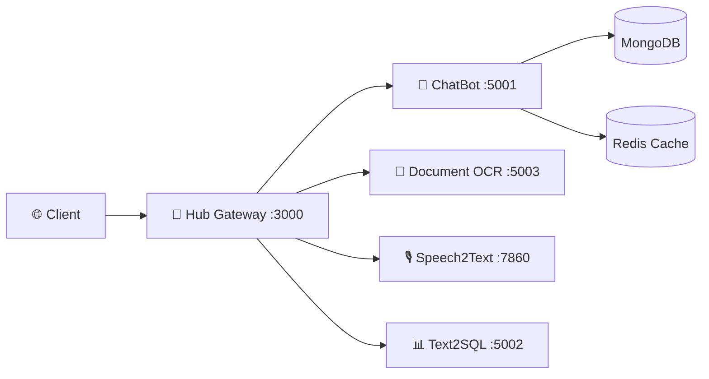

<div align="center">

<!-- Header Banner -->


<!-- Typing Animation -->
<a href="https://git.io/typing-svg">
</a>

<div>

    <!-- Badges Row 1 -->
<p>


</p>

</div>

<!-- Badges Row 2 -->
<p>
<a href="https://github.com/SkastVnT/AI-Assistant/stargazers"></a>
<a href="https://github.com/SkastVnT/AI-Assistant/releases"></a>
<a href="https://github.com/SkastVnT/AI-Assistant/blob/master/LICENSE"></a>
<a href="https://github.com/SkastVnT/AI-Assistant/actions"></a>
</p>

<!-- Navigation -->
<p>
<a href="#-features"></a>
<a href="#-quick-start"></a>
<a href="#-services"></a>
<a href="#-documentation"></a>
</p>

</div>

---

## ✨ Features

<table>
<tr>
<td width="50%">

### 💬 Multi-Model AI Chat
> GPT-4, GROK, DeepSeek, Qwen, Gemini  
> ✅ Streaming response  
> ✅ Code execution sandbox  
> ✅ MongoDB conversation storage

</td>
<td width="50%">

### 🎙️ Speech Recognition  
> Nhận dạng tiếng Việt chính xác  
> ✅ Speaker Diarization  
> ✅ Real-time transcription  
> ✅ Batch processing

</td>
</tr>
<tr>
<td width="50%">

### 📄 Document Intelligence
> PaddleOCR + AI Analysis  
> ✅ Table extraction  
> ✅ Multi-language OCR  
> ✅ PDF/Image support

</td>
<td width="50%">

### 🎨 Image Generation
> ComfyUI Node Workflows  
> ✅ Text-to-Image  
> ✅ Image-to-Image  
> ✅ LoRA fine-tuning

</td>
</tr>
<tr>
<td width="50%">

### 📊 Text to SQL
> Natural Language → SQL Query  
> ✅ MySQL/PostgreSQL  
> ✅ Vietnamese support  
> ✅ Auto-complete

</td>
<td width="50%">

### 🖼️ Image Upscale
> RealESRGAN Enhancement  
> ✅ 4x upscaling  
> ✅ Batch processing  
> ✅ GIF animation support

</td>
</tr>
</table>

---

## ⚡ Quick Start

```bash
# Clone & Run
git clone https://github.com/SkastVnT/AI-Assistant.git && cd AI-Assistant

# 🖥️ Windows - Interactive Menu
menu.bat

# 🐧 Linux/Mac
./menu.sh

# 🐳 Docker (Recommended)
docker-compose up -d
```

<details>
<summary>📦 <b>Start Individual Services</b></summary>

```bash
scripts\start-chatbot.bat          # 🤖 ChatBot      → localhost:5001
scripts\start-hub-gateway.bat      # 🎯 API Gateway  → localhost:3000
scripts\start-speech2text.bat      # 🎙️ Speech2Text  → localhost:7860
scripts\start-document-intelligence.bat  # 📄 OCR    → localhost:5003
scripts\start-text2sql.bat         # 📊 Text2SQL    → localhost:5002
```

</details>

---

## 🎯 Services

<div align="center">

| Service | Port | Description |
|:-------:|:----:|:------------|
| 🤖 **ChatBot** | `5001` | Multi-model AI • MongoDB storage • Code sandbox |
| 🎯 **Hub Gateway** | `3000` | API orchestration • Rate limiting • Auth |
| 📄 **Doc Intelligence** | `5003` | Vietnamese OCR • Table extraction • AI analysis |
| 🎙️ **Speech2Text** | `7860` | Whisper • Speaker diarization • Real-time |
| 📊 **Text2SQL** | `5002` | NL→SQL • MySQL/PostgreSQL • Vietnamese |
| 🎨 **ComfyUI** | `8188` | Node workflows • Custom nodes • LoRA |
| 🖼️ **Image Upscale** | `CLI` | RealESRGAN 4x • Batch • GIF support |
| ✨ **LoRA Training** | `CLI` | SD fine-tuning • Dataset prep |
| 🔌 **MCP Server** | `CLI` | Claude Desktop integration |

</div>

---

## 📁 Architecture



<details>
<summary>📂 <b>Project Structure</b></summary>

```
AI-Assistant/
├── 📦 services/           # Microservices
│   ├── chatbot/           # Flask + MongoDB + Multi-model
│   ├── hub-gateway/       # API Gateway + Auth
│   ├── speech2text/       # Whisper + Pyannote
│   ├── document-intelligence/
│   ├── text2sql/
│   ├── image-upscale/
│   ├── lora-training/
│   └── mcp-server/
├── 🎨 ComfyUI/            # Image Generation
├── 🔧 src/                # Shared modules
├── ⚙️ config/             # Configurations
├── 📜 scripts/            # 50+ automation scripts
├── 🧪 tests/              # Test suites
└── 🐳 docker/             # Docker configs
```

</details>

---

## 🐳 Docker

```bash
# Full stack
docker-compose up -d

# CPU-only (no GPU)
docker-compose -f docker-compose.light.yml up -d

# Health check
curl http://localhost:5001/health/detailed
```

---

## 🔧 Configuration

```env
# 🔑 Required
MONGODB_URI=mongodb://localhost:27017
GROK_API_KEY=your_key          # hoặc OPENAI_API_KEY

# 📦 Optional  
REDIS_HOST=localhost
FIREBASE_PROJECT_ID=your_project
```

> 💡 Copy `.env.example` → `.env`

---

## 📚 Documentation

<div align="center">

| 📖 Document | 📝 Description |
|:-----------:|:---------------|
| [SCRIPTS_GUIDE](SCRIPTS_GUIDE.md) | 50+ automation scripts guide |
| [SECURITY](SECURITY.md) | Security policy & audit report |
| [Requirements](requirements/) | Chunked dependency management |

</div>

---

## 👥 Contributors

<div align="center">

<a href="https://github.com/SkastVnT">
  
  <br/><b>SkastVnT</b>
  <br/><sub>🚀 Lead Developer</sub>
</a>
&nbsp;&nbsp;&nbsp;&nbsp;
<a href="https://github.com/sug1omyo">
  
  <br/><b>sug1omyo</b>
  <br/><sub>💻 Contributor</sub>
</a>

</div>

---

<div align="center">

## 📄 License

**MIT License** — [View License](LICENSE)

---

<a href="https://github.com/SkastVnT/AI-Assistant/stargazers">
  
</a>
<a href="https://discord.gg/d3K8Ck9NeR">
  
</a>

<!-- Footer Banner -->


</div>
