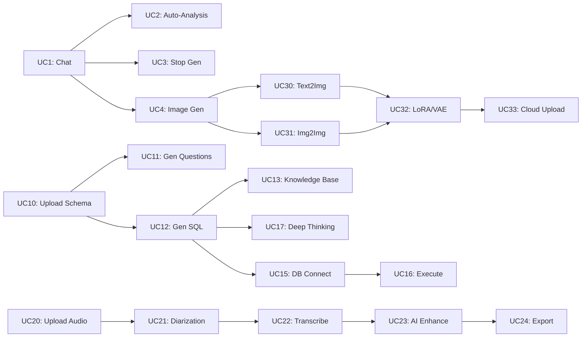
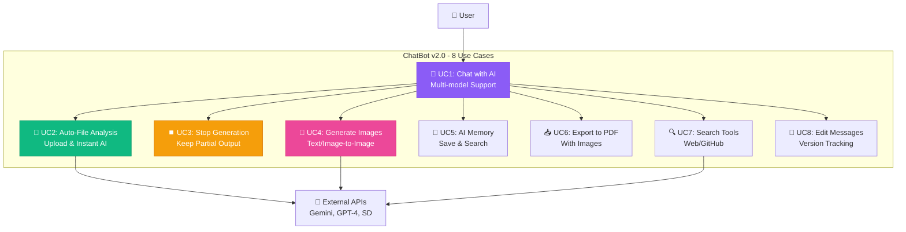
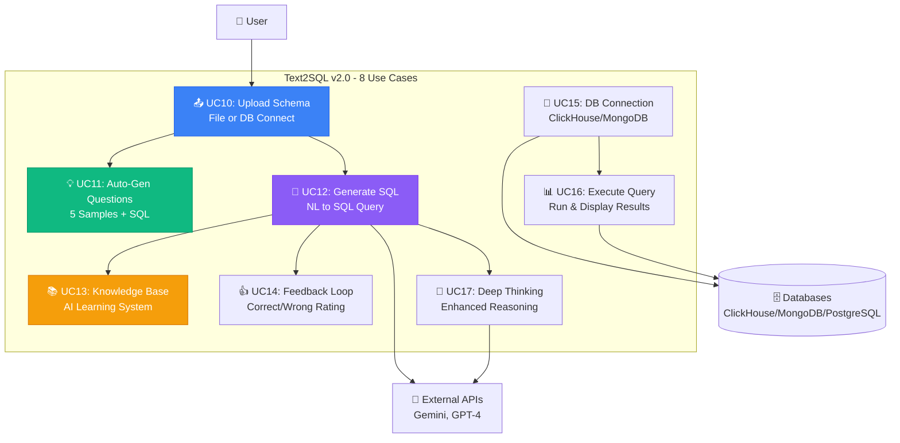
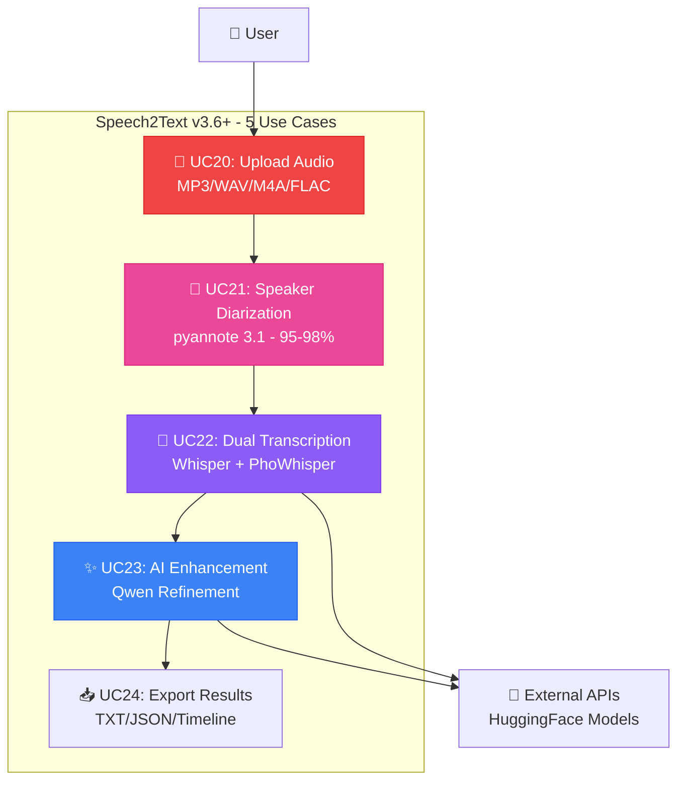
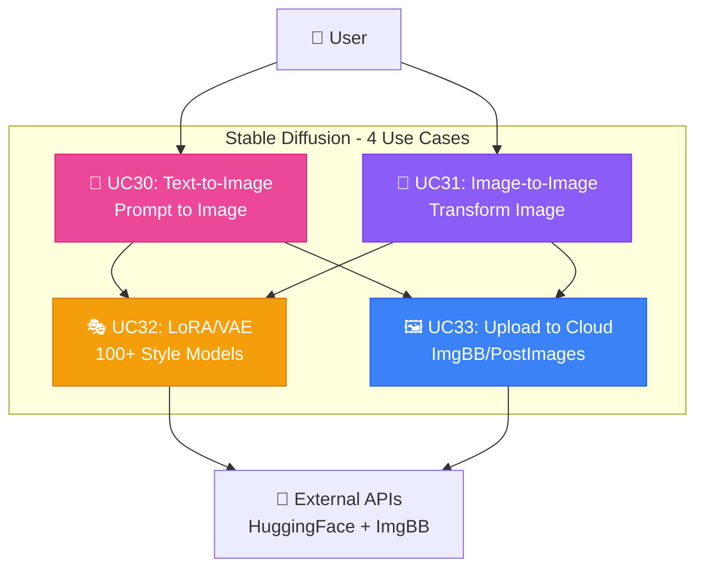
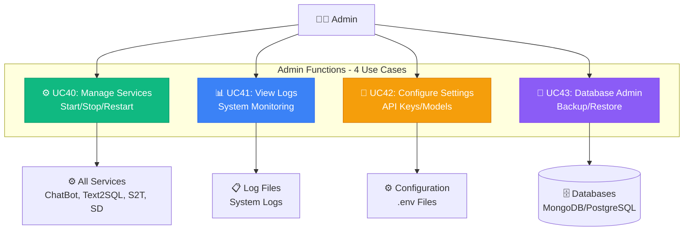
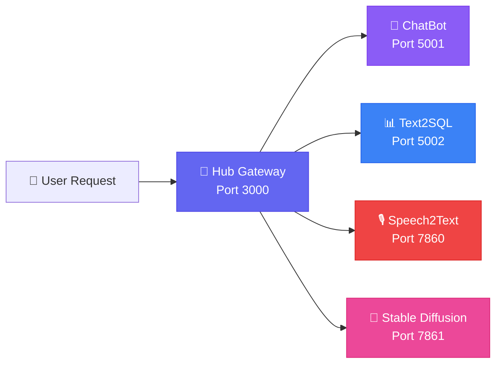
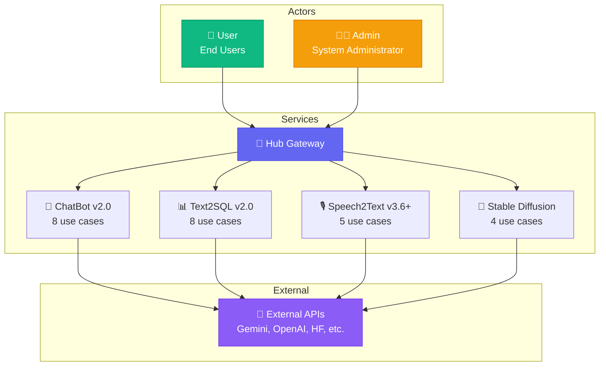

# 1️⃣ USE CASE DIAGRAM

> **Biểu đồ ca sử dụng hệ thống AI-Assistant v2.0**  
> Mô tả tương tác giữa người dùng và 6 services (Hub + 4 AI + Admin)  
> **Cập nhật:** 11/11/2025 - 32 use cases

---

## 📋 Mô tả

Use Case Diagram thể hiện:
- **Actors:** User (người dùng), Admin (quản trị viên), External APIs (API bên ngoài)
- **Services:** Hub Gateway + 4 dịch vụ AI độc lập
- **Use Cases:** 32 chức năng chính của toàn hệ thống

---

## 🎯 Biểu đồ Tổng Quan

```mermaid
graph TB
    subgraph Actors
        User[👤 User<br/>End Users]
        Admin[👨‍💼 Admin<br/>System Admin]
        ExternalAPI[🔌 External APIs<br/>Gemini, OpenAI, HF]
    end
    
    subgraph AI-Assistant Platform
        Hub[🎯 Hub Gateway<br/>Port 3000<br/>API Router]
        
        subgraph ChatBot Service v2.0
            UC1[💬 Chat with AI<br/>Multi-model]
            UC2[📎 Auto-File Analysis<br/>Upload & Instant AI]
            UC3[⏹️ Stop Generation<br/>Keep Partial Output]
            UC4[🎨 Generate Images<br/>Text/Image-to-Image]
            UC5[💾 AI Memory<br/>Save & Search]
            UC6[📥 Export to PDF<br/>With Images]
            UC7[🔍 Search Tools<br/>Web/GitHub]
            UC8[📝 Edit Messages<br/>Regenerate Versions]
        end
        
        subgraph Text2SQL Service v2.0
            UC10[📤 Upload Schema<br/>File/DB Connect]
            UC11[💡 Auto-Gen Questions<br/>5 Samples + SQL]
            UC12[🤖 Generate SQL<br/>NL → SQL]
            UC13[📚 Knowledge Base<br/>AI Learning]
            UC14[👍 Feedback Loop<br/>Correct/Wrong]
            UC15[🔌 DB Connection<br/>ClickHouse/Mongo]
            UC16[📊 Execute Query<br/>Run & Display]
            UC17[🧠 Deep Thinking<br/>Enhanced Reasoning]
        end
        
        subgraph Speech2Text Service v3.6+
            UC20[🎤 Upload Audio<br/>Multi-format]
            UC21[👥 Speaker Diarization<br/>pyannote 3.1]
            UC22[📝 Dual Transcription<br/>Whisper + PhoWhisper]
            UC23[✨ AI Enhancement<br/>Qwen Refinement]
            UC24[📥 Export Results<br/>TXT/JSON/Timeline]
        end
        
        subgraph Stable Diffusion Service
            UC30[🎨 Text-to-Image<br/>Prompt → Image]
            UC31[🔄 Image-to-Image<br/>Transform Image]
            UC32[🎭 LoRA/VAE<br/>Style Models]
            UC33[🖼️ Upload to Cloud<br/>ImgBB/PostImages]
        end
        
        subgraph Admin & Monitoring
            UC40[⚙️ Manage Services<br/>Start/Stop/Status]
            UC41[📊 View Logs<br/>System Monitoring]
            UC42[🔧 Configure Settings<br/>API Keys/Models]
            UC43[💾 Database Admin<br/>Backup/Restore]
        end
    end
    
    %% User Interactions
    User --> Hub
    Hub --> UC1
    Hub --> UC10
    Hub --> UC20
    Hub --> UC30
    
    %% ChatBot Flow
    UC1 --> UC2
    UC1 --> UC3
    UC1 --> UC4
    UC1 --> UC5
    UC1 --> UC6
    UC1 --> UC7
    UC1 --> UC8
    
    %% Text2SQL Flow
    UC10 --> UC11
    UC10 --> UC12
    UC12 --> UC13
    UC12 --> UC14
    UC12 --> UC17
    UC15 --> UC16
    
    %% Speech2Text Flow
    UC20 --> UC21
    UC21 --> UC22
    UC22 --> UC23
    UC23 --> UC24
    
    %% Stable Diffusion Flow
    UC30 --> UC32
    UC31 --> UC32
    UC30 --> UC33
    UC31 --> UC33
    
    %% Admin Flow
    Admin --> UC40
    Admin --> UC41
    Admin --> UC42
    Admin --> UC43
    
    %% External API Dependencies
    UC1 --> ExternalAPI
    UC2 --> ExternalAPI
    UC4 --> ExternalAPI
    UC7 --> ExternalAPI
    UC12 --> ExternalAPI
    UC17 --> ExternalAPI
    UC22 --> ExternalAPI
    UC23 --> ExternalAPI
    UC30 --> ExternalAPI
    UC31 --> ExternalAPI
    UC33 --> ExternalAPI
    
    style Hub fill:#6366F1,stroke:#4F46E5,color:#fff
    style User fill:#10B981,stroke:#059669,color:#fff
    style Admin fill:#F59E0B,stroke:#D97706,color:#fff
    style ExternalAPI fill:#8B5CF6,stroke:#7C3AED,color:#fff
```



---

## 📊 Chi tiết Use Cases

### 🤖 ChatBot Service v2.0 (8 use cases)

| ID | Use Case | Mô tả | Tính năng mới v2.0 | Actor |
|:---|:---------|:------|:-------------------|:------|
| UC1 | Chat with AI | Multi-model AI (Gemini, GPT-4, DeepSeek, Qwen) | ✅ Full-screen UI | User |
| UC2 | Auto-File Analysis | Upload file → AI tự động phân tích ngay | ✅ NEW v2.0 | User |
| UC3 | Stop Generation | Dừng AI giữa chừng và giữ lại output | ✅ NEW v2.0 | User |
| UC4 | Generate Images | Text2Img + Img2Img với SD API | Enhanced params | User → API |
| UC5 | AI Memory | Lưu conversations + images vào MongoDB | ✅ With images | User |
| UC6 | Export to PDF | Export chat với images & metadata | ✅ Enhanced | User |
| UC7 | Search Tools | Google Search + GitHub API | Working | User → API |
| UC8 | Edit Messages | Edit & regenerate với version tracking | ✅ NEW v2.0 | User |

**Key Features v2.0:**
- 📎 Auto-file analysis up to 50MB
- ⏹️ Stop button keeps partial output
- 📝 Message version history
- 💯 Full-screen ChatGPT-like UI
- 🧹 Smart storage with auto-cleanup

---

### 📊 Text2SQL Service v2.0 (8 use cases)

| ID | Use Case | Mô tả | Tính năng mới v2.0 | Actor |
|:---|:---------|:------|:-------------------|:------|
| UC10 | Upload Schema | Upload .txt/.sql/.json hoặc connect DB | Multi-format | User |
| UC11 | Auto-Gen Questions | AI tạo 5 câu hỏi mẫu + SQL | ✅ NEW v2.0 | User |
| UC12 | Generate SQL | Tiếng Việt/Anh → SQL query | Enhanced | User → API |
| UC13 | Knowledge Base | AI học từ feedback, reuse queries | ✅ AI Learning | System |
| UC14 | Feedback Loop | Đánh giá đúng/sai để AI học | ✅ NEW v2.0 | User |
| UC15 | DB Connection | Kết nối ClickHouse/MongoDB/PostgreSQL | Direct connect | User |
| UC16 | Execute Query | Chạy SQL và hiển thị kết quả | Real-time | User |
| UC17 | Deep Thinking | Enhanced reasoning cho complex queries | ✅ NEW v2.0 | User → API |

**Key Features v2.0:**
- 🧠 AI Learning từ correct queries
- 💡 Auto-generate sample questions
- 🔌 Direct database connection
- 📚 Knowledge base search trước khi gen
- 🚀 Deploy FREE trên Render.com

---

### 🎙️ Speech2Text Service v3.6+ (5 use cases)

| ID | Use Case | Mô tả | Technology | Actor |
|:---|:---------|:------|:-----------|:------|
| UC20 | Upload Audio | Upload MP3/WAV/M4A/FLAC | Drag & drop WebUI | User |
| UC21 | Speaker Diarization | Phân biệt 2-5 người nói | pyannote.audio 3.1 | System |
| UC22 | Dual Transcription | Whisper + PhoWhisper fusion | 98%+ accuracy | System |
| UC23 | AI Enhancement | Qwen refinement, smart punctuation | Qwen2.5-1.5B | System → API |
| UC24 | Export Results | TXT/JSON/Timeline format | Multi-format | User |

**Key Features v3.6+:**
- 🎯 Dual-model fusion (Whisper + PhoWhisper)
- 👥 95-98% diarization accuracy
- 🇻🇳 98%+ Vietnamese accuracy
- ⚡ VAD for 30-50% speedup
- 🌐 Professional Web UI

---

### 🎨 Stable Diffusion Service (4 use cases)

| ID | Use Case | Mô tả | Features | Actor |
|:---|:---------|:------|:---------|:------|
| UC30 | Text-to-Image | Tạo ảnh từ text prompt | Advanced params | User → API |
| UC31 | Image-to-Image | Chỉnh sửa ảnh với prompt | Denoising control | User → API |
| UC32 | LoRA/VAE | Áp dụng style models | 100+ LoRA models | System → API |
| UC33 | Upload to Cloud | Upload ảnh lên ImgBB/PostImages | Auto-upload | System → API |

**Key Features:**
- 🎨 AUTOMATIC1111 WebUI
- 🔥 LoRA + VAE support
- 🎮 ControlNet integration
- ⚡ CUDA 12.1 optimized
- 🔌 REST API enabled

---

### ⚙️ Admin & Monitoring (4 use cases)

| ID | Use Case | Mô tả | Tools | Actor |
|:---|:---------|:------|:------|:------|
| UC40 | Manage Services | Start/Stop/Restart các services | Docker/systemd | Admin |
| UC41 | View Logs | Xem system logs, errors | logging system | Admin |
| UC42 | Configure Settings | API keys, models, parameters | .env files | Admin |
| UC43 | Database Admin | Backup/restore databases | MongoDB Atlas, pg_dump | Admin |

---

## 🔗 Quan hệ giữa Use Cases

### Include Relationships (bắt buộc thực hiện)
- **UC1** (Chat) → UC2, UC3, UC8 (built-in features)
- **UC1** (Chat) → UC4, UC5, UC6, UC7 (optional tools)
- **UC10** (Upload Schema) → UC11 (auto-generate questions)
- **UC12** (Generate SQL) → UC13, UC17 (KB search & deep thinking)
- **UC20** (Upload Audio) → UC21 (auto diarization)
- **UC21** (Diarization) → UC22 (transcription)
- **UC22** (Transcribe) → UC23 (AI enhancement)

### Extend Relationships (mở rộng tùy chọn)
- **UC12** (Generate SQL) extend→ UC15, UC16 (nếu có DB connection)
- **UC30/UC31** (Image Gen) extend→ UC32 (nếu chọn LoRA/VAE)
- **UC30/UC31** (Image Gen) extend→ UC33 (nếu upload to cloud)
- **UC4** (ChatBot Images) extend→ UC33 (auto-upload)

### Dependency Flow


---

## 📈 Thống kê

| Metric | Số lượng | Chi tiết |
|:-------|:---------|:---------|
| **Tổng Use Cases** | 32 | Production-ready |
| **ChatBot** | 8 | v2.0 với auto-analysis |
| **Text2SQL** | 8 | v2.0 với AI learning |
| **Speech2Text** | 5 | v3.6+ dual-model |
| **Stable Diffusion** | 4 | AUTOMATIC1111 |
| **Admin** | 4 | Management & monitoring |
| **Primary Actors** | 2 | User, Admin |
| **External Systems** | 8+ | Gemini, OpenAI, HF, ImgBB... |
| **Services** | 6 | Hub + 4 AI + Admin |

---

## 🚀 Luồng hoạt động cơ bản

### User Journey - ChatBot
```
1. User opens Web UI (localhost:5001)
2. Select model (Gemini/GPT-4/DeepSeek)
3. Upload file OR type message
4. AI auto-analyzes OR responds
5. User can Stop generation mid-way
6. Save to Memory OR Export PDF
```

### User Journey - Text2SQL
```
1. User opens Web UI (localhost:5002)
2. Upload schema OR connect DB
3. AI auto-generates 5 sample questions
4. User types custom question
5. AI checks Knowledge Base first
6. Generate SQL with optional Deep Thinking
7. Execute query if DB connected
8. Provide feedback (correct/wrong)
```

### User Journey - Speech2Text
```
1. User opens Web UI (localhost:7860)
2. Drag & drop audio file
3. System processes:
   - Preprocessing (10-15%)
   - Diarization (20-40%)
   - Whisper transcription (55-75%)
   - PhoWhisper transcription (78-88%)
   - Qwen enhancement (92-98%)
4. Download results (TXT/JSON/Timeline)
```

---

## 📝 Ghi chú kỹ thuật

### Technology Stack per Service

**ChatBot v2.0:**
- Backend: Flask 3.0, Python 3.10+
- Database: MongoDB Atlas (conversations, messages, memory)
- AI: Gemini 2.0, GPT-4, DeepSeek, Qwen (local)
- Storage: Local + ImgBB cloud

**Text2SQL v2.0:**
- Backend: Flask 3.0, Python 3.10+
- Database: PostgreSQL (main), ClickHouse (analytics)
- AI: Gemini 2.0 Flash (primary, FREE)
- Features: Knowledge Base, Deep Thinking mode

**Speech2Text v3.6+:**
- Backend: Gradio WebUI, Python 3.10+
- AI: Whisper large-v3, PhoWhisper-large, Qwen2.5-1.5B
- Diarization: pyannote.audio 3.1
- Processing: VAD-enabled for speedup

**Stable Diffusion:**
- Framework: AUTOMATIC1111 WebUI
- Models: SD 1.5/2.1/SDXL, 100+ LoRA
- API: REST API enabled (port 7861)
- GPU: CUDA 12.1 optimized

### External API Dependencies
- ✅ **Google Gemini API** - Primary LLM (FREE tier)
- ✅ **OpenAI API** - GPT-4 advanced reasoning
- ✅ **DeepSeek API** - Cost-effective alternative
- ✅ **HuggingFace Hub** - Model hosting & diarization
- ✅ **Google Search API** - Web search integration
- ✅ **GitHub API** - Code search
- ✅ **ImgBB API** - Image cloud storage

### Future Enhancements
- [ ] Hub Gateway authentication (JWT/OAuth2)
- [ ] Rate limiting & caching (Redis)
- [ ] User management system
- [ ] Payment integration for premium features
- [ ] Mobile app (React Native)
- [ ] Real-time collaboration
- [ ] Advanced analytics dashboard

---

## 📸 Biểu Đồ Chi Tiết (Chia Nhỏ Để Chụp)

> **Các biểu đồ dưới đây được chia nhỏ theo từng service để dễ dàng chụp màn hình và đưa vào Word/PowerPoint**

---

### 1️⃣ ChatBot Service Use Cases



---

### 2️⃣ Text2SQL Service Use Cases



---

### 3️⃣ Speech2Text Service Use Cases



---

### 4️⃣ Stable Diffusion Service Use Cases



---

### 5️⃣ Admin & Monitoring Use Cases



---

### 6️⃣ Hub Gateway Flow



---

### 7️⃣ Actor Relationships Overview



---

## 📝 Hướng Dẫn Sử Dụng Diagrams

### Để chụp và đưa vào Word:
1. **Mở từng diagram riêng** trên GitHub (render tự động)
2. **Chụp màn hình** (Windows: Win + Shift + S)
3. **Paste vào Word** (Ctrl + V)
4. **Resize** cho phù hợp với trang

### Hoặc sử dụng Mermaid Live Editor:
1. Copy code mermaid của diagram muốn chụp
2. Mở https://mermaid.live
3. Paste code vào
4. Export as PNG/SVG
5. Insert vào Word

### Kích thước khuyến nghị:
- **Diagram tổng quan:** Full page width (16cm)
- **Diagram từng service:** Half page (8cm mỗi cái)
- **Flow diagrams:** 10-12cm width

---

<div align="center">

[⬅️ Back to Diagram Index](README.md) | [➡️ Next: Class Diagram](02_class_diagram.md)

</div>
