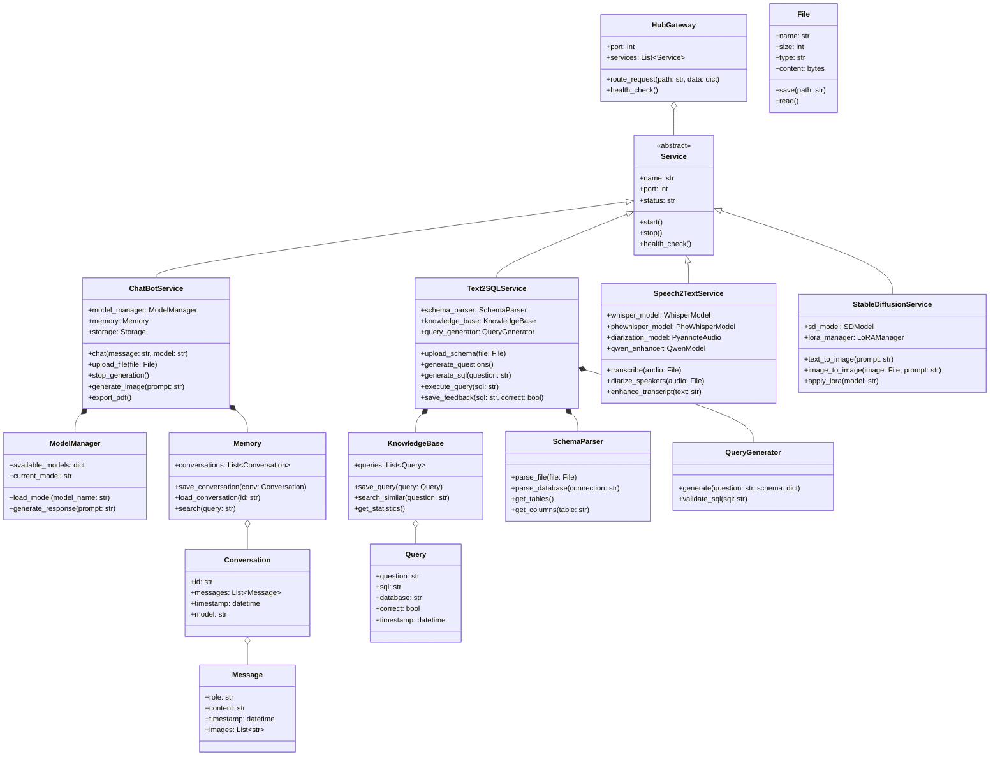

# 2️⃣ CLASS DIAGRAM

> **Biểu đồ lớp hệ thống AI-Assistant**  
> Mô tả cấu trúc hướng đối tượng và quan hệ giữa các class

---

## 📋 Mô tả

Class Diagram thể hiện:
- **Classes:** Các lớp chính của hệ thống (4 services + Hub Gateway)
- **Attributes:** Thuộc tính của mỗi class
- **Methods:** Phương thức/hàm của mỗi class
- **Relationships:** Kế thừa, kết hợp, phụ thuộc

---

## 🎯 Biểu đồ



---

## 📊 Chi tiết Classes

### 🎯 Core Classes

#### HubGateway
**Vai trò:** API Gateway - điều hướng requests đến các services

| Attribute | Type | Mô tả |
|:----------|:-----|:------|
| `port` | int | Port của Hub (default: 5000) |
| `services` | List[Service] | Danh sách các services đăng ký |

| Method | Return | Mô tả |
|:-------|:-------|:------|
| `route_request(path, data)` | dict | Route request đến service phù hợp |
| `health_check()` | bool | Kiểm tra health của tất cả services |

**File thực tế:** `hub.py`

---

#### Service (Abstract Base Class)
**Vai trò:** Base class cho tất cả services

| Attribute | Type | Mô tả |
|:----------|:-----|:------|
| `name` | str | Tên service |
| `port` | int | Port của service |
| `status` | str | 'running', 'stopped', 'error' |

| Method | Return | Mô tả |
|:-------|:-------|:------|
| `start()` | None | Khởi động service |
| `stop()` | None | Dừng service |
| `health_check()` | bool | Kiểm tra trạng thái |

---

### 🤖 ChatBotService

**File thực tế:** `ChatBot/app.py`, `ChatBot/src/chatbot_engine.py`

| Attribute | Type | Mô tả |
|:----------|:-----|:------|
| `model_manager` | ModelManager | Quản lý AI models |
| `memory` | Memory | Lưu trữ conversations |
| `storage` | Storage | File storage system |

| Method | Parameters | Return | Mô tả |
|:-------|:-----------|:-------|:------|
| `chat()` | message: str, model: str | str | Chat với AI |
| `upload_file()` | file: File | dict | Upload & analyze file |
| `stop_generation()` | - | str | Dừng generation |
| `generate_image()` | prompt: str | str | Gen ảnh với SD |
| `export_pdf()` | - | bytes | Export chat to PDF |

**Dependencies:**
- Gemini API
- OpenAI API
- Stable Diffusion API

---

### 📊 Text2SQLService

**File thực tế:** `Text2SQL Services/app_simple.py`, `Text2SQL Services/src/`

| Attribute | Type | Mô tả |
|:----------|:-----|:------|
| `schema_parser` | SchemaParser | Parse database schema |
| `knowledge_base` | KnowledgeBase | AI learning system |
| `query_generator` | QueryGenerator | Generate SQL |

| Method | Parameters | Return | Mô tả |
|:-------|:-----------|:-------|:------|
| `upload_schema()` | file: File | dict | Upload schema file |
| `generate_questions()` | - | List[str] | Tạo câu hỏi mẫu |
| `generate_sql()` | question: str | str | Generate SQL |
| `execute_query()` | sql: str | dict | Execute SQL |
| `save_feedback()` | sql: str, correct: bool | None | Save to KB |

**Dependencies:**
- Gemini API
- ClickHouse/MongoDB drivers

---

### 🎙️ Speech2TextService

**File thực tế:** `Speech2Text Services/app.py`

| Attribute | Type | Mô tả |
|:----------|:-----|:------|
| `whisper_model` | WhisperModel | Whisper model |
| `phowhisper_model` | PhoWhisperModel | Vietnamese model |
| `diarization_model` | PyannoteAudio | Speaker diarization |
| `qwen_enhancer` | QwenModel | Text enhancement |

| Method | Parameters | Return | Mô tả |
|:-------|:-----------|:-------|:------|
| `transcribe()` | audio: File | str | Transcribe audio |
| `diarize_speakers()` | audio: File | List[dict] | Phân biệt người nói |
| `enhance_transcript()` | text: str | str | Cải thiện text |

**Dependencies:**
- Whisper Large-v3
- PhoWhisper base
- pyannote.audio 3.1
- Qwen2.5-1.5B

---

### 🎨 StableDiffusionService

**File thực tế:** `stable-diffusion-webui/`

| Attribute | Type | Mô tả |
|:----------|:-----|:------|
| `sd_model` | SDModel | Stable Diffusion model |
| `lora_manager` | LoRAManager | LoRA model manager |

| Method | Parameters | Return | Mô tả |
|:-------|:-----------|:-------|:------|
| `text_to_image()` | prompt: str | bytes | Text → Image |
| `image_to_image()` | image: File, prompt: str | bytes | Image → Image |
| `apply_lora()` | model: str | None | Apply LoRA |

**Dependencies:**
- AUTOMATIC1111 WebUI
- CUDA 12.1
- xformers

---

## 🔗 Quan hệ giữa Classes

### Inheritance (Kế thừa)
```
Service (abstract)
├── ChatBotService
├── Text2SQLService
├── Speech2TextService
└── StableDiffusionService
```

### Composition (Kết hợp chặt)
- **ChatBotService** *has-a* ModelManager, Memory
- **Text2SQLService** *has-a* SchemaParser, KnowledgeBase, QueryGenerator
- **Memory** *has-a* List[Conversation]
- **Conversation** *has-a* List[Message]

### Aggregation (Kết hợp lỏng)
- **HubGateway** *aggregates* Services
- **KnowledgeBase** *aggregates* Queries

---

## 📈 Thống kê

| Metric | Số lượng |
|:-------|:---------|
| **Tổng Classes** | 16 |
| **Service Classes** | 4 |
| **Helper Classes** | 7 |
| **Data Classes** | 5 |
| **Abstract Classes** | 1 |

---

## 🛠️ Design Patterns sử dụng

1. **Abstract Factory Pattern**: `Service` base class
2. **Singleton Pattern**: `ModelManager`, `KnowledgeBase` (1 instance)
3. **Strategy Pattern**: Different AI models trong `ModelManager`
4. **Repository Pattern**: `Memory`, `KnowledgeBase` (data access)
5. **Gateway Pattern**: `HubGateway` (API routing)

---

## 🚀 Extension Points (Điểm mở rộng)

### Dễ dàng thêm:
1. **Service mới**: Kế thừa `Service` abstract class
2. **AI model mới**: Thêm vào `ModelManager.available_models`
3. **Database mới**: Extend `SchemaParser` với driver mới
4. **Storage backend mới**: Implement interface của `Memory`/`KnowledgeBase`

### Ví dụ thêm service:
```python
class VideoAnalysisService(Service):
    def __init__(self):
        super().__init__(name="VideoAnalysis", port=5004)
        self.video_processor = VideoProcessor()
    
    def analyze_video(self, video: File) -> dict:
        # Implementation
        pass
```

---

## 📝 Ghi chú kỹ thuật

### Hiện tại:
- Services chạy độc lập (Flask apps)
- Communication qua HTTP REST APIs
- Không có shared database (mỗi service có storage riêng)

### Đề xuất cải tiến:
1. **Message Queue**: RabbitMQ/Redis cho async processing
2. **Centralized Database**: PostgreSQL cho shared data
3. **Microservices**: Containerize với Docker
4. **Service Discovery**: Consul/Eureka
5. **API Gateway**: Kong/Tyk thay cho Hub đơn giản

---

<div align="center">

[⬅️ Previous: Use Case](01_usecase_diagram.md) | [Back to Index](README.md) | [➡️ Next: Sequence Diagrams](03_sequence_diagrams.md)

</div>
