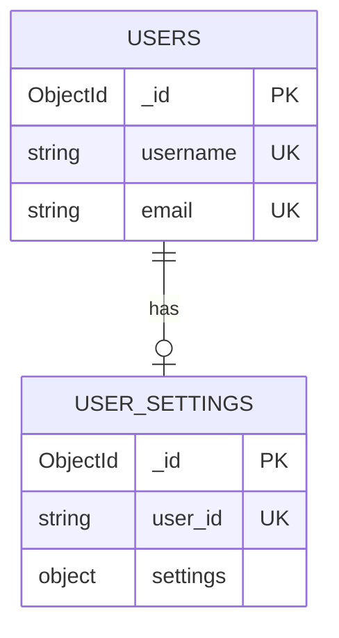
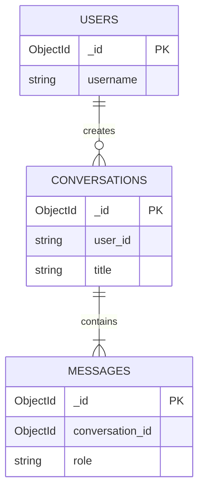
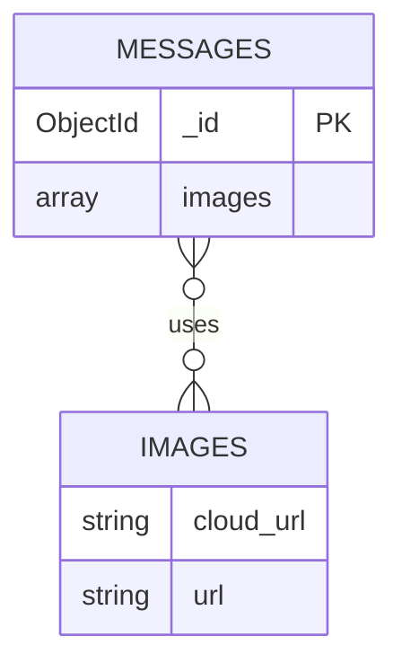
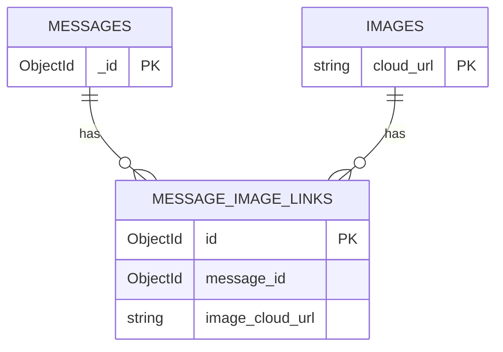

# 5️⃣.1 CARDINALITY DIAGRAMS — 1–1, 1–N, N–N (Project Examples)

> Các sơ đồ quan hệ theo bội số (cardinality) rút gọn, bám đúng vào dữ liệu của dự án.

---

## 1️⃣ 1–1 (One-to-One)

Ví dụ: User ↔ User Settings (mỗi user có đúng một cấu hình)

Notes:
- user_id trong USER_SETTINGS là duy nhất, đảm bảo 1–1.

---

## 2️⃣ 1–N (One-to-Many)

Ví dụ A: User → Conversations (một user có nhiều phiên chat)  
Ví dụ B: Conversation → Messages (một hội thoại có nhiều tin nhắn)

Notes:
- CONVERSATIONS.user_id tham chiếu USER._id  
- MESSAGES.conversation_id tham chiếu CONVERSATIONS._id

---

## 3️⃣ N–N (Many-to-Many)

Trong MongoDB của dự án, quan hệ N–N thường biểu diễn bằng mảng lồng (embedded array) hoặc tham chiếu, không dùng bảng nối. Dưới đây là hai cách trình bày để dễ chụp màn hình:

### 3A. N–N (Logical) — Messages ↔ Images (embedded array)

Ghi chú: IMAGES là thực thể logic (ảnh nằm ngoài DB, chỉ lưu metadata trong mảng images của MESSAGES).

### 3B. N–N (Conceptual with junction) — If normalized as join

Ghi chú: Đây là mô hình khái niệm nếu cần tách bảng nối. Trong dự án hiện tại, bạn đang dùng mảng images[] trong MESSAGES.

---

## 🔚 NAVIGATION

[⬅️ Full System ER](05_er_diagram_all.md) | [MongoDB ER](05_er_diagram_mongodb.md) | [Database Design](04_database_design.md)
