# 6️⃣ COMPONENT DIAGRAM

> **Biểu đồ thành phần hệ thống AI-Assistant**  
> Mô tả kiến trúc tổng thể, services, dependencies, và communication

---

## 📋 Mô tả

Component Diagram thể hiện:
- **Components:** 4 services + Hub Gateway + External dependencies
- **Interfaces:** RESTful APIs, WebSockets, File I/O
- **Dependencies:** Libraries, AI models, cloud services
- **Communication:** HTTP, WebSocket, gRPC (future)

---

## 🎯 System Architecture Overview

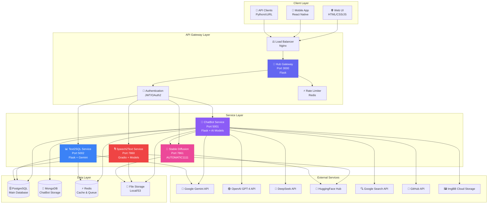

---

## 🧩 Component Details

### 1. 🎯 Hub Gateway Component

**Vai trò:** API Gateway & Service Orchestrator

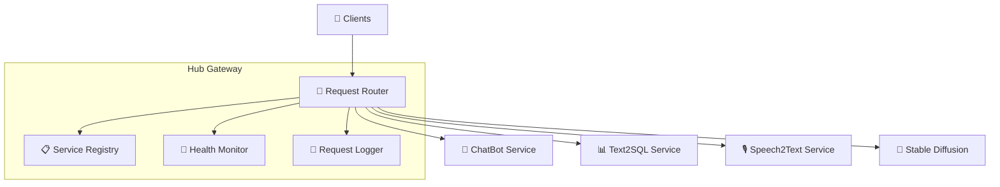

**Dependencies:**
- **Framework:** Flask 3.0+
- **Routing:** Flask-RESTful
- **CORS:** Flask-CORS
- **Logging:** Python logging + File rotation

**Interfaces:**
```python
# Provided interfaces
GET  /health                    # Health check all services
POST /api/route                 # Route request to service
GET  /api/services              # List all services
GET  /api/logs                  # Get system logs

# Required interfaces
- ChatBot API: http://localhost:5001
- Text2SQL API: http://localhost:5002
- Speech2Text API: http://localhost:7860
- Stable Diffusion API: http://localhost:7861
```

**Current Implementation:**
- ✅ Basic routing
- ✅ Health check
- ⚠️ No authentication yet
- ⚠️ No rate limiting yet

---

### 2. 🤖 ChatBot Service Component

**Vai trò:** Multi-model AI conversational interface with file analysis

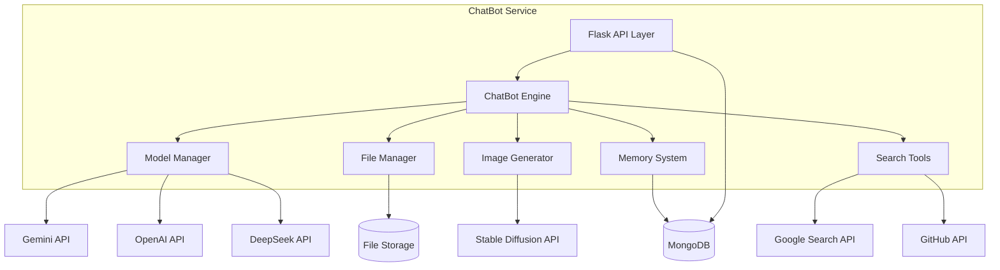

**Dependencies:**
```yaml
Core Framework:
  - Flask 3.0+
  - Flask-CORS
  - python-dotenv
  
AI Models:
  - google-generativeai (Gemini 2.0 Flash)
  - openai (GPT-4, GPT-3.5)
  - anthropic (Claude 3.5 - optional)
  
Database:
  - pymongo >= 4.6.0
  - dnspython >= 2.4.0
  
File Processing:
  - PyPDF2
  - Pillow (PIL)
  - python-magic
  - markdown-it-py
  
Image Generation:
  - requests (for SD API)
  
Search & Tools:
  - google-api-python-client
  - PyGithub
  
Export:
  - reportlab (PDF export)
  - weasyprint (alternative)
```

**Interfaces:**
```python
# Provided REST APIs
POST /chat                      # Send message to AI
POST /upload                    # Upload & analyze file
POST /stop-generation           # Stop AI generation
POST /api/generate-image        # Generate image with SD
GET  /api/conversations         # Get conversations
GET  /api/conversation/<id>     # Get conversation details
DELETE /api/conversation/<id>   # Delete conversation
GET  /api/models                # List available models
POST /api/export-pdf            # Export chat to PDF
GET  /api/search                # Google/GitHub search

# Required APIs
- MongoDB: mongodb+srv://...
- Gemini API: https://generativelanguage.googleapis.com
- OpenAI API: https://api.openai.com
- Stable Diffusion: http://localhost:7861/sdapi/v1
- Google Search: https://www.googleapis.com/customsearch
- GitHub: https://api.github.com
```

**File Structure:**
```
ChatBot/
├── app.py                      # Main Flask app
├── src/
│   ├── chatbot_engine.py       # Core engine
│   ├── model_manager.py        # AI model switcher
│   ├── file_handler.py         # File upload/analysis
│   └── tools/
│       ├── search_google.py
│       └── search_github.py
├── config/
│   ├── mongodb_config.py       # MongoDB client
│   ├── mongodb_helpers.py      # CRUD operations
│   └── mongodb_schema.py       # Schema docs
├── Storage/
│   ├── conversations/          # JSON files (backup)
│   ├── uploaded_files/         # User uploads
│   └── generated_images/       # SD images
└── templates/
    └── index.html              # WebUI
```

**Current Status:**
- ✅ Multi-model support (5+ models)
- ✅ Auto-file analysis (up to 50MB)
- ✅ Stop generation
- ✅ Message versioning
- ✅ MongoDB integration
- ✅ Image generation
- ✅ Google/GitHub search
- ✅ PDF export
- ⚠️ No streaming responses yet
- ⚠️ No voice input/output yet

---

### 3. 📊 Text2SQL Service Component

**Vai trò:** Natural Language to SQL Query Generation with AI Learning

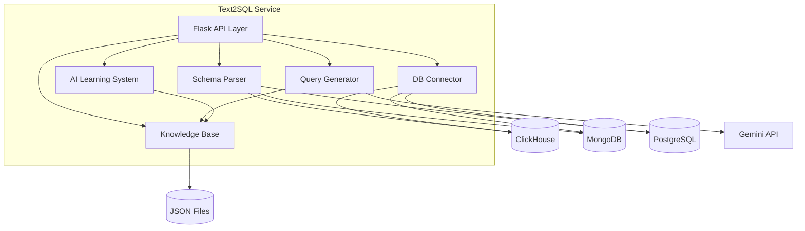

**Dependencies:**
```yaml
Core Framework:
  - Flask 3.0+
  - Flask-CORS
  - python-dotenv
  
AI Models:
  - google-generativeai (Gemini 2.0 Flash)
  
Database Drivers:
  - clickhouse-driver
  - pymongo
  - psycopg2-binary (PostgreSQL)
  - mysql-connector-python
  
Schema Parsing:
  - sqlparse
  - json
  - pandas (for data preview)
  
Knowledge Base:
  - sentence-transformers (embeddings)
  - faiss-cpu (similarity search)
  
Utilities:
  - hashlib (schema hashing)
  - re (regex for SQL parsing)
```

**Interfaces:**
```python
# Provided REST APIs
POST /upload-schema             # Upload schema file
POST /parse-schema              # Parse schema from text
GET  /sample-questions          # Generate sample questions
POST /chat                      # Generate SQL from question
POST /execute-query             # Execute SQL query
POST /feedback                  # Save correct/wrong feedback
GET  /knowledge-base            # Get KB statistics
GET  /databases                 # List connected databases
POST /connect-database          # Add DB connection

# Required APIs
- Gemini API: https://generativelanguage.googleapis.com
- ClickHouse: tcp://localhost:9000
- MongoDB: mongodb://localhost:27017
- PostgreSQL: postgresql://localhost:5432
```

**File Structure:**
```
Text2SQL Services/
├── app_simple.py               # Main Flask app
├── src/
│   ├── schema_parser.py        # Parse schema
│   ├── query_generator.py      # Generate SQL
│   ├── knowledge_base.py       # AI learning
│   └── db_connector.py         # DB connections
├── data/
│   ├── knowledge_base/         # Saved queries
│   │   ├── clickhouse.jsonl
│   │   ├── mongodb.jsonl
│   │   └── postgresql.jsonl
│   └── schemas/                # Uploaded schemas
└── templates/
    └── index.html              # WebUI
```

**Current Status:**
- ✅ Multi-database support (ClickHouse, MongoDB, PostgreSQL, MySQL)
- ✅ AI learning system with Knowledge Base
- ✅ Sample question generation
- ✅ Deep thinking mode
- ✅ Vietnamese + English support
- ✅ Deploy on Render.com FREE tier
- ⚠️ No vector DB yet (using simple similarity)
- ⚠️ No query optimization suggestions

---

### 4. 🎙️ Speech2Text Service Component

**Vai trò:** Dual-model audio transcription with speaker diarization

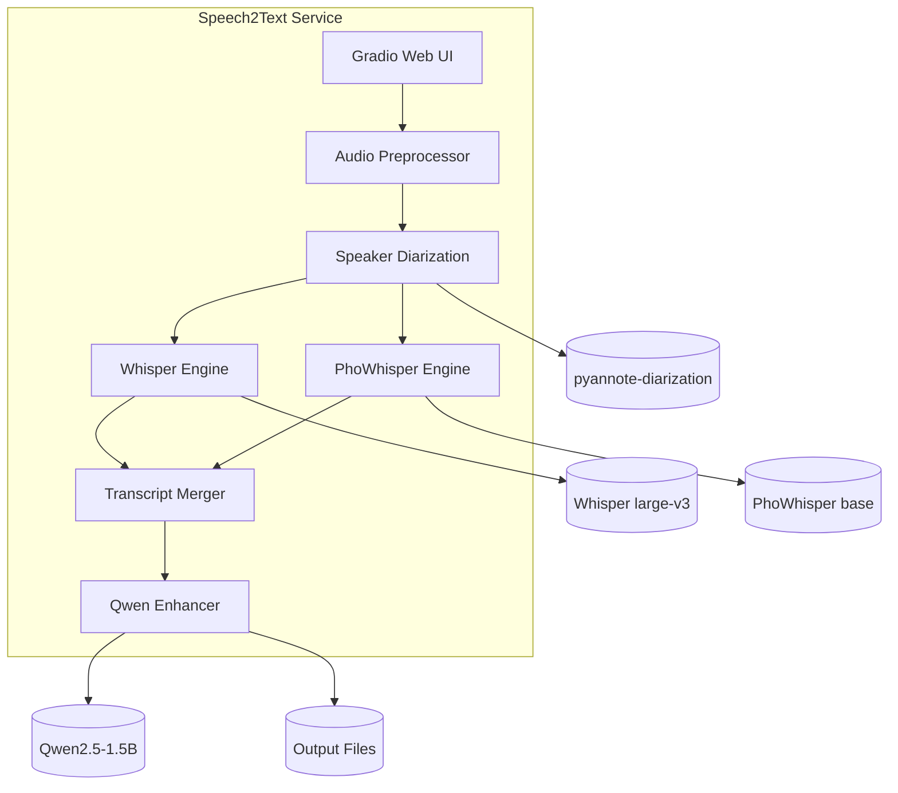

**Dependencies:**
```yaml
Core Framework:
  - gradio >= 4.0
  - fastapi (Gradio uses)
  
Audio Processing:
  - librosa >= 0.10.0
  - soundfile >= 0.12.0
  - pydub >= 0.25.0
  - ffmpeg-python
  
ASR Models:
  - openai-whisper
  - transformers >= 4.36.0
  - torch >= 2.0.0
  - torchaudio
  
Diarization:
  - pyannote.audio >= 3.1.0
  - speechbrain >= 0.5.0
  
Enhancement:
  - transformers (Qwen2.5)
  
Utilities:
  - numpy
  - scipy
  - python-dotenv
```

**Interfaces:**
```python
# Gradio UI (Web Interface)
- Input: Audio file upload (MP3/WAV/M4A/FLAC)
- Output: Transcript with speaker labels
- Settings: Model selection, VAD, enhancement

# Internal Functions (Future REST API)
POST /transcribe                # Transcribe audio
GET  /models                    # List available models
GET  /transcription/<id>        # Get transcription result
DELETE /transcription/<id>      # Delete result
```

**File Structure:**
```
Speech2Text Services/
├── app.py                      # Gradio app
├── s2t/
│   ├── core/
│   │   ├── transcriber.py      # Whisper transcription
│   │   ├── diarization.py      # Speaker diarization
│   │   └── enhancer.py         # Qwen enhancement
│   └── utils/
│       ├── audio_utils.py      # Audio preprocessing
│       └── text_utils.py       # Text formatting
├── models/                     # Downloaded models
│   ├── whisper-large-v3/
│   ├── phowhisper-base/
│   ├── pyannote-diarization/
│   └── qwen2.5-1.5b/
├── output/                     # Transcription results
└── data/                       # Input audio files
```

**Current Status:**
- ✅ Dual-model fusion (Whisper + PhoWhisper)
- ✅ Speaker diarization (pyannote.audio)
- ✅ Vietnamese fine-tuned (PhoWhisper)
- ✅ AI enhancement (Qwen2.5)
- ✅ VAD optimization (Silero VAD)
- ✅ GPU acceleration (CUDA)
- ✅ Multiple audio formats
- ⚠️ No real-time streaming yet
- ⚠️ No custom vocabulary training

---

### 5. 🎨 Stable Diffusion Service Component

**Vai trò:** AI Image Generation (Text-to-Image, Image-to-Image)

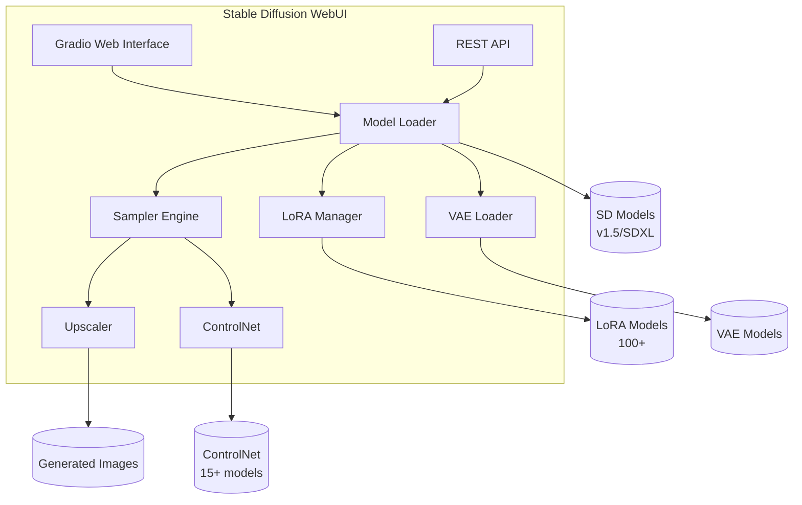

**Dependencies:**
```yaml
Core Framework:
  - gradio >= 3.50.0
  - fastapi
  
SD Core:
  - torch >= 2.0.0
  - torchvision
  - diffusers >= 0.21.0
  - transformers >= 4.36.0
  
Acceleration:
  - xformers >= 0.0.21
  - accelerate >= 0.24.0
  
Image Processing:
  - opencv-python
  - Pillow >= 10.0.0
  - numpy
  
Models:
  - safetensors >= 0.4.0
  - omegaconf
  
Utilities:
  - tqdm
  - einops
  - kornia
```

**Interfaces:**
```python
# Gradio UI
- Text-to-Image tab
- Image-to-Image tab
- Extras (upscaling, face restoration)
- Settings

# REST API (AUTOMATIC1111 API)
POST /sdapi/v1/txt2img          # Text to image
POST /sdapi/v1/img2img          # Image to image
GET  /sdapi/v1/sd-models        # List models
POST /sdapi/v1/options          # Set options
GET  /sdapi/v1/progress         # Get progress
POST /sdapi/v1/interrupt        # Stop generation
GET  /sdapi/v1/loras            # List LoRAs
GET  /sdapi/v1/samplers         # List samplers
```

**File Structure:**
```
stable-diffusion-webui/
├── webui.py                    # Main entry point
├── modules/
│   ├── api/                    # REST API
│   ├── processing.py           # Image generation
│   ├── sd_models.py            # Model management
│   ├── sd_samplers.py          # Samplers
│   └── extras.py               # Upscaling, etc.
├── extensions/
│   └── sd-webui-controlnet/    # ControlNet
├── models/
│   ├── Stable-diffusion/       # Base models
│   ├── Lora/                   # LoRA models
│   ├── VAE/                    # VAE models
│   └── ControlNet/             # ControlNet models
└── outputs/
    └── txt2img-images/         # Generated images
```

**Current Status:**
- ✅ Text-to-Image generation
- ✅ Image-to-Image modification
- ✅ LoRA support (100+ models)
- ✅ VAE support
- ✅ ControlNet (15+ models)
- ✅ Multiple samplers
- ✅ Upscaling (4x)
- ✅ Face restoration
- ✅ REST API enabled
- ✅ CUDA 12.1 optimized
- ⚠️ No batch processing UI
- ⚠️ No training support yet

---

## 🔗 Communication Patterns

### 1. Client-Server (REST APIs)

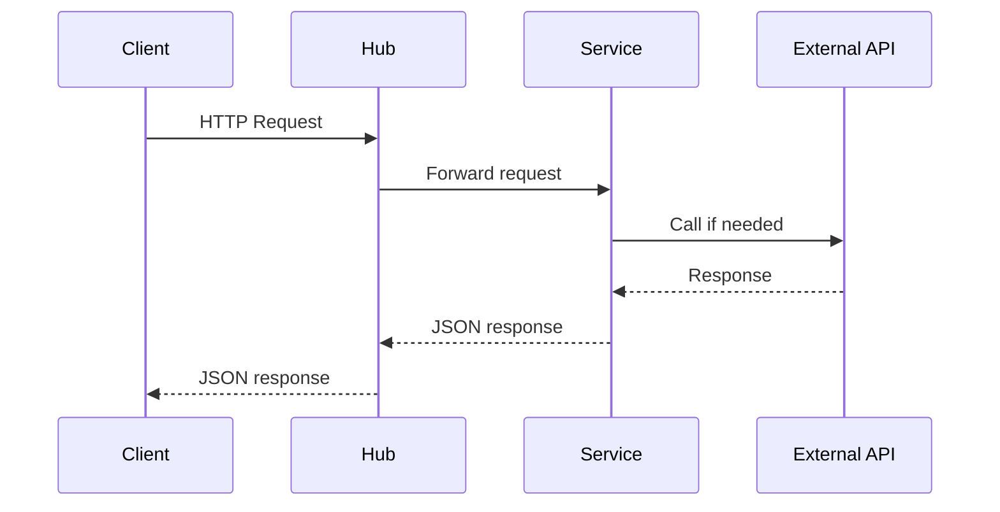

**Protocol:** HTTP/1.1  
**Format:** JSON  
**Authentication:** None (future: JWT)  
**Rate Limit:** None (future: Redis-based)

---

### 2. Service-to-Service (Internal)

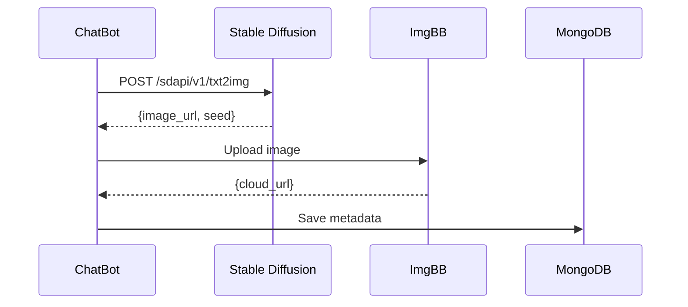

**Protocol:** HTTP (localhost)  
**Format:** JSON  
**Timeout:** 60s (configurable)

---

### 3. Database Access

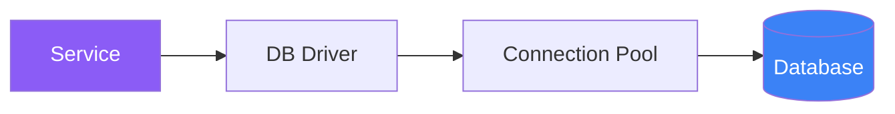

**Pattern:** Connection Pooling  
**Libraries:** pymongo, psycopg2, clickhouse-driver  
**Max Connections:** 10-50 per service

---

## 📦 Deployment Architecture

### Option 1: Local Development (Current)

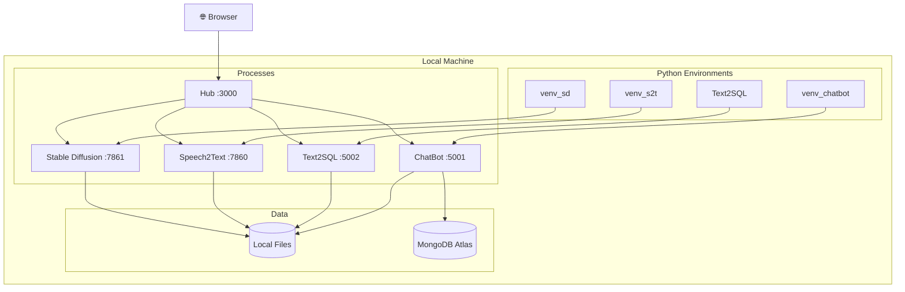

**Pros:** ✅ Easy setup, full control  
**Cons:** ❌ Not scalable, manual process management

---

### Option 2: Docker Compose (Recommended)

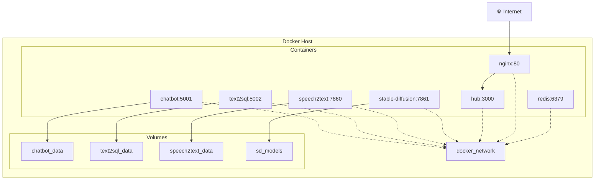

**Pros:** ✅ Easy deployment, isolation, portability  
**Cons:** ⚠️ Resource overhead, learning curve

**docker-compose.yml:**
```yaml
version: '3.8'
services:
  hub:
    build: ./src
    ports: ["3000:3000"]
    depends_on: [chatbot, text2sql]
  
  chatbot:
    build: ./ChatBot
    ports: ["5001:5001"]
    environment:
      - GEMINI_API_KEY=${GEMINI_API_KEY}
    volumes:
      - chatbot_data:/app/Storage
  
  # ... other services
```

---

### Option 3: Cloud Deployment (Production)

```mermaid
graph TB
    subgraph Cloud Provider - Azure/AWS/GCP
        subgraph Load Balancer
            LB[Azure Load Balancer]
        end
        
        subgraph App Services
            AS1[ChatBot VM]
            AS2[Text2SQL VM]
            AS3[Speech2Text VM]
            AS4[Stable Diffusion GPU VM]
        end
        
        subgraph Storage
            Blob[Azure Blob Storage]
            SQL[Azure PostgreSQL]
            Cache[Azure Redis Cache]
        end
        
        subgraph CDN
            CDN[Azure CDN]
        end
        
        LB --> AS1
        LB --> AS2
        LB --> AS3
        LB --> AS4
        
        AS1 --> SQL
        AS1 --> Blob
        AS1 --> Cache
        
        AS2 --> SQL
        AS2 --> Cache
        
        AS3 --> Blob
        AS4 --> Blob
        
        CDN --> Blob
    end
    
    Users[🌍 Users] --> CDN
    Users --> LB
```

**Estimated Cost (Azure - 1K users):**
- VMs: $200-500/month
- Storage: $50-100/month
- Database: $100-200/month
- Bandwidth: $50-100/month
- **Total:** ~$400-900/month

---

## 🔐 Security Components

### 1. Authentication & Authorization (Future)

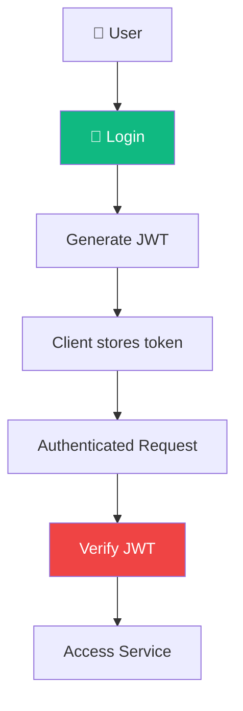

**Implementation Plan:**
- Library: `PyJWT`, `Flask-JWT-Extended`
- Token expiry: 24 hours
- Refresh token: 7 days

---

### 2. Rate Limiting (Future)

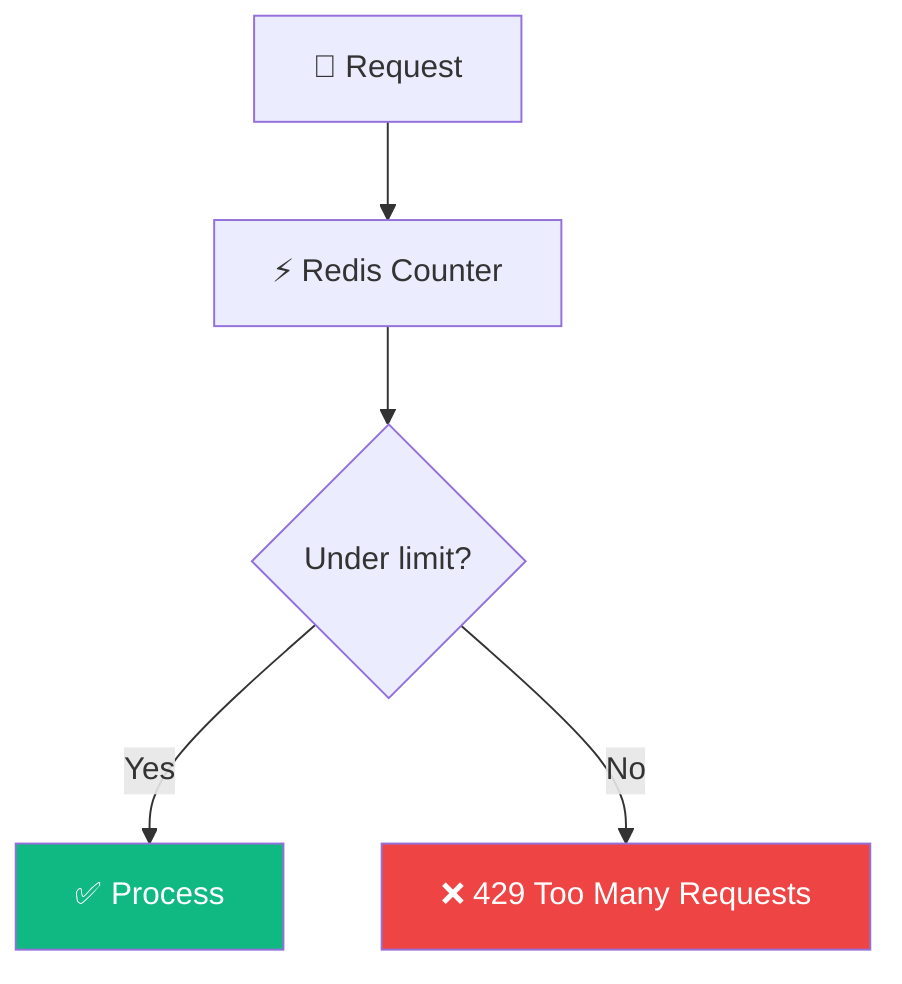

**Limits:**
- Free tier: 100 req/hour
- Paid tier: 1000 req/hour
- Enterprise: Unlimited

---

## 📈 Scalability Strategies

### Horizontal Scaling

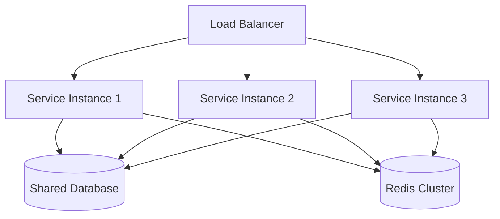

**Benefits:**
- Handle more concurrent users
- Fault tolerance (if one instance fails)
- Auto-scaling based on load

---

## 📝 Monitoring & Observability (Future)

### Proposed Stack:

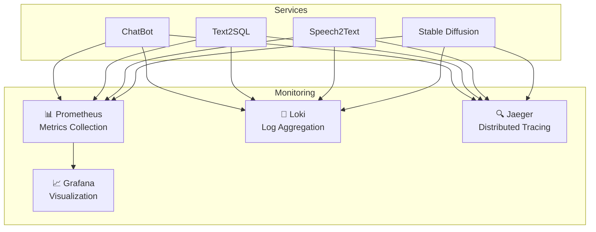

**Metrics to track:**
- Request rate (req/sec)
- Response time (p50, p95, p99)
- Error rate (%)
- CPU/Memory usage
- Active connections
- Model inference time

---

## 🎯 Summary

| Aspect | Count | Status |
|:-------|:------|:-------|
| **Core Services** | 4 | ✅ Production |
| **Gateway** | 1 | ⚠️ Basic |
| **Databases** | 3 | ✅ Active |
| **External APIs** | 7 | ✅ Integrated |
| **Deployment Options** | 3 | ✅ Documented |
| **Authentication** | 0 | 🚧 Planned |
| **Monitoring** | 0 | 🚧 Planned |

---

<div align="center">

[⬅️ Previous: ER Diagram](05_er_diagram.md) | [Back to Index](README.md) | [➡️ Next: Activity Diagram](07_activity_diagram.md)

</div>
