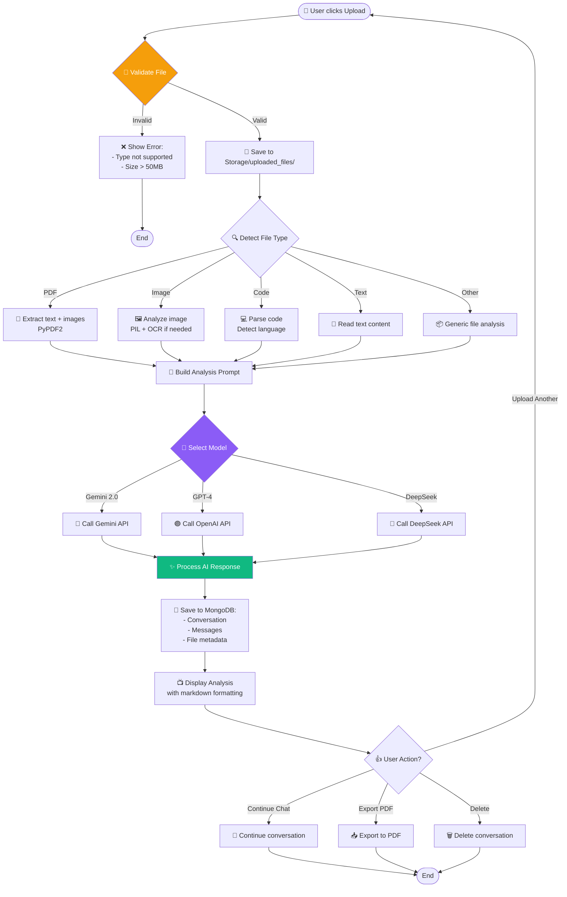
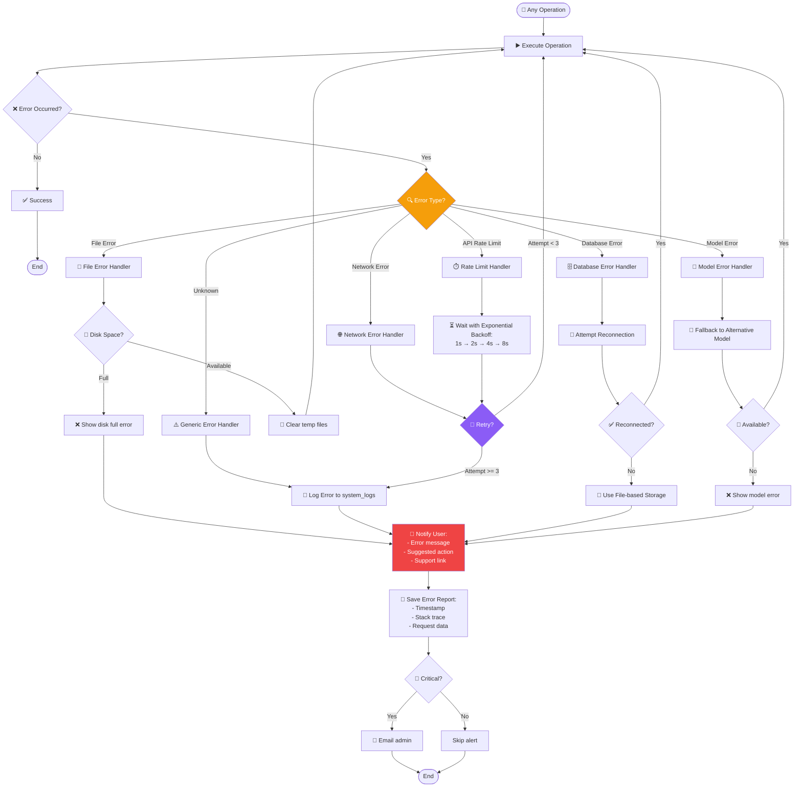

# 7️⃣ ACTIVITY DIAGRAM

> **Biểu đồ hoạt động hệ thống AI-Assistant**  
> Mô tả luồng xử lý chi tiết cho các workflows quan trọng

---

## 📋 Mô tả

Activity Diagram thể hiện:
- **Activities:** Các hoạt động/bước xử lý
- **Decision Points:** Điều kiện rẽ nhánh
- **Parallel Activities:** Xử lý song song
- **Swimlanes:** Phân tách trách nhiệm theo components

---

## 🎯 Key Workflows

1. **ChatBot - File Upload & Auto-Analysis**
2. **Text2SQL - AI Learning with Knowledge Base**
3. **Speech2Text - Dual-Model Transcription**
4. **Stable Diffusion - Image Generation**
5. **Error Handling & Recovery**
6. **User Authentication (Future)**

---

## 1️⃣ ChatBot - File Upload & Auto-Analysis Workflow



### Chi tiết các bước:

| Step | Actor | Action | Time | Error Handling |
|:----:|:------|:-------|:-----|:---------------|
| 1 | User | Click upload button | - | - |
| 2 | WebUI | Validate file type & size | 10ms | Show error if invalid |
| 3 | Server | Save to `Storage/uploaded_files/` | 100-500ms | Retry 3x if disk error |
| 4 | Server | Detect file type (magic bytes) | 50ms | Fallback to extension |
| 5 | Server | Extract content based on type | 0.5-5s | Try alternative parser |
| 6 | Server | Build analysis prompt | 50ms | Use default template |
| 7 | Server | Select AI model (user pref) | 10ms | Default to Gemini |
| 8 | AI API | Process file & generate analysis | 2-10s | Retry 3x with backoff |
| 9 | Server | Format markdown response | 100ms | Plain text fallback |
| 10 | Server | Save to MongoDB | 50-200ms | Log error, continue |
| 11 | WebUI | Render analysis with highlight.js | 200ms | - |

---

## 2️⃣ Text2SQL - AI Learning with Knowledge Base

```mermaid
graph TB
    Start([👤 User enters question]) --> ParseQuestion[📝 Parse & Clean Question]
    
    ParseQuestion --> HashSchema[#️⃣ Hash Current Schema<br/>MD5]
    
    HashSchema --> SearchKB{🔍 Search Knowledge Base}
    
    SearchKB -->|Found Match<br/>95%+ similarity| RetrieveSQL[⚡ Retrieve Saved SQL<br/>~300ms fast!]
    SearchKB -->|No Match| CheckDeepThinking{🧠 Deep Thinking?}
    
    RetrieveSQL --> IncrementUsage[📊 Increment usage_count]
    IncrementUsage --> DisplaySQLFast[📺 Display SQL<br/>Source: Knowledge Base]
    DisplaySQLFast --> AskFeedback
    
    CheckDeepThinking -->|Yes| DeepThinkingMode[💭 Deep Thinking Mode:<br/>- Analyze schema<br/>- Consider edge cases<br/>- Generate explanation]
    CheckDeepThinking -->|No| StandardMode[🚀 Standard Mode:<br/>- Quick generation]
    
    DeepThinkingMode --> BuildPrompt[🧩 Build Gemini Prompt:<br/>- Schema<br/>- Question<br/>- Database type<br/>- Best practices]
    StandardMode --> BuildPrompt
    
    BuildPrompt --> CallGemini[🔷 Call Gemini 2.0 Flash API]
    
    CallGemini --> ParseResponse{✅ Valid SQL?}
    
    ParseResponse -->|Yes| FormatSQL[🎨 Format SQL:<br/>- Syntax highlighting<br/>- Add comments]
    ParseResponse -->|No| RegenerateSQL[🔁 Regenerate<br/>with clarification]
    
    RegenerateSQL --> CallGemini
    
    FormatSQL --> DisplaySQL[📺 Display SQL<br/>Source: AI Generated]
    
    DisplaySQL --> AskFeedback{👤 User Feedback?}
    
    AskFeedback -->|✅ Correct| SaveToKB[💾 Save to Knowledge Base:<br/>- Question<br/>- SQL<br/>- Schema hash<br/>- Timestamp]
    AskFeedback -->|❌ Wrong| RegenerateSQL
    AskFeedback -->|Execute| ExecuteQuery[▶️ Execute Query]
    AskFeedback -->|Edit| ManualEdit[✏️ Manual Edit]
    
    SaveToKB --> ExecuteQuery
    
    ExecuteQuery --> ConnectDB{🔌 DB Connected?}
    
    ConnectDB -->|No| ShowConnectError[❌ Show connection error]
    ConnectDB -->|Yes| RunQuery[🏃 Run SQL Query]
    
    RunQuery --> QueryResult{📊 Result?}
    
    QueryResult -->|Success| DisplayResults[📈 Display Results:<br/>- Table view<br/>- Charts (optional)<br/>- Export options]
    QueryResult -->|Error| DisplayError[❌ Display Error:<br/>- Syntax error<br/>- Permissions<br/>- Timeout]
    
    DisplayResults --> UpdateStats[📊 Update Stats:<br/>- Execution time<br/>- Rows returned<br/>- Success rate]
    
    UpdateStats --> End1([End])
    DisplayError --> End1
    ShowConnectError --> End1
    ManualEdit --> End1
    
    style SearchKB fill:#F59E0B,color:#fff
    style RetrieveSQL fill:#10B981,color:#fff
    style SaveToKB fill:#3B82F6,color:#fff
    style CallGemini fill:#8B5CF6,color:#fff
```

### Knowledge Base Matching Logic:

```python
def search_knowledge_base(question, schema_hash, db_type):
    """
    1. Filter by database_type and schema_hash
    2. Calculate similarity score (embeddings or fuzzy match)
    3. Return if similarity >= 0.95
    4. Sort by usage_count (most reused first)
    """
    matches = db.query(
        "SELECT * FROM sql_knowledge_base "
        "WHERE database_type = ? AND schema_hash = ? "
        "ORDER BY usage_count DESC"
    )
    
    for match in matches:
        similarity = calculate_similarity(question, match.question)
        if similarity >= 0.95:
            return match.sql_query
    
    return None  # Generate new SQL
```

### Performance Comparison:

| Scenario | Knowledge Base Hit | New Generation |
|:---------|:-------------------|:---------------|
| **Time** | ~300ms | 2.5-5.5s |
| **Cost** | Free | $0.0001 API call |
| **Accuracy** | 99% (validated) | 85-95% |
| **Speed** | ⚡⚡⚡⚡⚡ | ⚡⚡⚡ |

---

## 3️⃣ Speech2Text - Dual-Model Transcription

```mermaid
graph TB
    Start([👤 User uploads audio]) --> ValidateAudio{🎵 Validate Audio}
    
    ValidateAudio -->|Invalid format| ShowError[❌ Error: Unsupported format<br/>Support: MP3/WAV/M4A/FLAC]
    ValidateAudio -->|Valid| SaveAudio[💾 Save to data/ folder]
    
    ShowError --> End1([End])
    
    SaveAudio --> Preprocess[🔊 Preprocessing:<br/>- Convert to 16kHz mono<br/>- Normalize volume<br/>- Remove silence (VAD)]
    
    Preprocess --> DiarizationCheck{👥 Enable Diarization?}
    
    DiarizationCheck -->|Yes| RunDiarization[🎭 Speaker Diarization<br/>pyannote.audio]
    DiarizationCheck -->|No| SkipDiarization[Skip to transcription]
    
    RunDiarization --> SpeakerSegments[📋 Get Speaker Segments:<br/>- SPEAKER_00: 0s-10s<br/>- SPEAKER_01: 10s-15s<br/>...]
    
    SpeakerSegments --> ParallelTranscribe
    SkipDiarization --> ParallelTranscribe
    
    ParallelTranscribe --> ParallelSplit[⚡ Parallel Processing]
    
    ParallelSplit --> WhisperPath[Path A: Whisper Large-v3]
    ParallelSplit --> PhoWhisperPath[Path B: PhoWhisper base]
    
    WhisperPath --> WhisperTranscribe[🌍 Transcribe<br/>- 99 languages<br/>- High accuracy]
    PhoWhisperPath --> PhoWhisperTranscribe[🇻🇳 Transcribe<br/>- Vietnamese optimized<br/>- Better accents]
    
    WhisperTranscribe --> WhisperResult[📝 Transcript1 + Confidence]
    PhoWhisperTranscribe --> PhoWhisperResult[📝 Transcript2 + Confidence]
    
    WhisperResult --> Merge[🔀 Merge Transcripts]
    PhoWhisperResult --> Merge
    
    Merge --> MergeLogic{🧠 Merge Strategy}
    
    MergeLogic -->|High confidence<br/>Whisper > 0.8| UseWhisper[Use Whisper text]
    MergeLogic -->|High confidence<br/>PhoWhisper > 0.8| UsePhoWhisper[Use PhoWhisper text]
    MergeLogic -->|Both low confidence| WeightedAverage[Weighted blend:<br/>60% Whisper + 40% PhoWhisper]
    
    UseWhisper --> MergedText[📄 Merged Transcript]
    UsePhoWhisper --> MergedText
    WeightedAverage --> MergedText
    
    MergedText --> EnhanceCheck{✨ Enable Enhancement?}
    
    EnhanceCheck -->|Yes| QwenEnhance[🤖 Qwen2.5 Enhancement:<br/>- Fix grammar<br/>- Add punctuation<br/>- Capitalize names]
    EnhanceCheck -->|No| SkipEnhance[Skip enhancement]
    
    QwenEnhance --> EnhancedText[📝 Enhanced Transcript]
    SkipEnhance --> EnhancedText
    
    EnhancedText --> AlignSpeakers{👥 Has Speaker Data?}
    
    AlignSpeakers -->|Yes| AlignTimeline[🕒 Align transcript with speakers:<br/>SPEAKER_00: "Hello..."<br/>SPEAKER_01: "Hi..."]
    AlignSpeakers -->|No| NoAlignment[Single speaker transcript]
    
    AlignTimeline --> FinalTranscript[📋 Final Transcript with Timeline]
    NoAlignment --> FinalTranscript
    
    FinalTranscript --> SaveResults[💾 Save Results:<br/>- Raw transcript<br/>- Enhanced transcript<br/>- Speaker timeline JSON<br/>- Metadata]
    
    SaveResults --> DisplayUI[📺 Display in Gradio UI:<br/>- Colored by speaker<br/>- Timestamps<br/>- Download options]
    
    DisplayUI --> End2([End])
    
    style ParallelSplit fill:#F59E0B,color:#fff
    style Merge fill:#8B5CF6,color:#fff
    style QwenEnhance fill:#10B981,color:#fff
```

### Processing Timeline:

```
┌─────────────────────────────────────────────────┐
│ 10-minute Audio File Processing                │
├─────────────────────────────────────────────────┤
│ Preprocessing (VAD)          │ 10-15s    │ 10% │
│ Diarization (pyannote)       │ 40-60s    │ 30% │
│ Whisper Transcription        │ 60-90s    │ 40% │ ⟸ Parallel
│ PhoWhisper Transcription     │ 60-90s    │ 40% │ ⟸ Parallel
│ Merge Transcripts            │ 2-5s      │  2% │
│ Qwen Enhancement             │ 10-15s    │  8% │
│ Align & Format               │ 2-5s      │  2% │
│ Save Results                 │ 1-2s      │  1% │
├─────────────────────────────────────────────────┤
│ TOTAL TIME                   │ 150-250s  │100% │
│ (ratio 1:1.5 to 1:2.5)                          │
└─────────────────────────────────────────────────┘
```

---

## 4️⃣ Stable Diffusion - Image Generation Workflow

```mermaid
graph TB
    Start([👤 User enters prompt]) --> ValidatePrompt{📝 Valid Prompt?}
    
    ValidatePrompt -->|Empty| ShowError[❌ Error: Prompt required]
    ValidatePrompt -->|Valid| SelectMode{🎨 Generation Mode?}
    
    ShowError --> End1([End])
    
    SelectMode -->|Text-to-Image| T2IPath[🆕 Text-to-Image]
    SelectMode -->|Image-to-Image| I2IPath[🔄 Image-to-Image]
    
    I2IPath --> ValidateSourceImage{🖼️ Has Source Image?}
    ValidateSourceImage -->|No| ShowError
    ValidateSourceImage -->|Yes| LoadImage[📂 Load Source Image]
    
    T2IPath --> ConfigureParams[⚙️ Configure Parameters]
    LoadImage --> ConfigureParams
    
    ConfigureParams --> SelectModel[🤖 Select SD Model:<br/>- SD v1.5<br/>- SDXL<br/>- Custom]
    
    SelectModel --> ApplyLoRA{🎭 Apply LoRA?}
    
    ApplyLoRA -->|Yes| SelectLoRAs[📚 Select LoRA Models:<br/>- anime_style (0.8)<br/>- detailed_face (0.6)]
    ApplyLoRA -->|No| SkipLoRA[Skip LoRA]
    
    SelectLoRAs --> LoadLoRA[⚙️ Load LoRA weights]
    LoadLoRA --> ApplyVAE
    SkipLoRA --> ApplyVAE{🎨 Apply VAE?}
    
    ApplyVAE -->|Yes| LoadVAE[🌈 Load VAE Model]
    ApplyVAE -->|No| SkipVAE[Skip VAE]
    
    LoadVAE --> SetSampler
    SkipVAE --> SetSampler[🔧 Set Sampler:<br/>- DPM++ 2M Karras<br/>- Euler a<br/>- DDIM]
    
    SetSampler --> SetSteps[⏱️ Set Steps:<br/>20-50 (quality vs speed)]
    
    SetSteps --> SetCFG[🎚️ Set CFG Scale:<br/>7.0 (default)<br/>Higher = more prompt adherence]
    
    SetCFG --> SetSeed{🎲 Seed?}
    
    SetSeed -->|Random| GenerateSeed[🎲 Generate random seed]
    SetSeed -->|Fixed| UseSeed[🔢 Use provided seed]
    
    GenerateSeed --> StartGeneration
    UseSeed --> StartGeneration[▶️ Start Generation]
    
    StartGeneration --> CheckStop{⏹️ User clicked Stop?}
    
    CheckStop -->|Yes| InterruptGen[🛑 Interrupt generation]
    CheckStop -->|No| ContinueGen[⏳ Processing...<br/>Step 1/30... 2/30...]
    
    InterruptGen --> PartialResult[🖼️ Return partial result]
    
    ContinueGen --> MonitorProgress{📊 Progress}
    MonitorProgress -->|Step N/Total| UpdateUI[📺 Update UI progress bar]
    UpdateUI --> MonitorProgress
    MonitorProgress -->|Complete| GenerationDone[✅ Generation Complete]
    
    GenerationDone --> PostProcess[✨ Post-processing:<br/>- Face restoration<br/>- Upscale (optional)]
    
    PostProcess --> SaveImage[💾 Save Image:<br/>- outputs/txt2img-images/<br/>- Filename: timestamp_seed.png]
    
    SaveImage --> ComputeHash[#️⃣ Compute image hash<br/>MD5 for deduplication]
    
    ComputeHash --> SaveMetadata[💾 Save Metadata:<br/>- Prompt<br/>- Negative prompt<br/>- Model, LoRAs, VAE<br/>- Seed, steps, CFG]
    
    SaveMetadata --> DisplayImage[📺 Display Generated Image]
    
    DisplayImage --> UserAction{👤 User Action?}
    
    UserAction -->|Save| DownloadImage[📥 Download image]
    UserAction -->|Send to ChatBot| SendToChatBot[🤖 Send to ChatBot API]
    UserAction -->|Upload to Cloud| UploadCloud[☁️ Upload to ImgBB]
    UserAction -->|Generate Similar| ReuseSeed[♻️ Reuse seed + variation]
    
    SendToChatBot --> End2([End])
    DownloadImage --> End2
    UploadCloud --> End2
    ReuseSeed --> SetSeed
    PartialResult --> End2
    
    style SelectMode fill:#F59E0B,color:#fff
    style StartGeneration fill:#8B5CF6,color:#fff
    style PostProcess fill:#10B981,color:#fff
```

### Parameter Recommendations:

| Use Case | Sampler | Steps | CFG | Resolution |
|:---------|:--------|:------|:----|:-----------|
| **Quick Preview** | Euler a | 20 | 7.0 | 512x512 |
| **Balanced Quality** | DPM++ 2M Karras | 30 | 7.5 | 768x768 |
| **High Quality** | DPM++ SDE Karras | 50 | 8.0 | 1024x1024 |
| **Photorealistic** | DDIM | 40 | 7.0 | 768x768 |
| **Anime/Art** | Euler a | 28 | 11.0 | 512x768 |

---

## 5️⃣ Error Handling & Recovery Workflow



### Error Categories:

| Error Type | Example | Recovery Strategy | Max Retries |
|:-----------|:--------|:------------------|:------------|
| **Network Error** | Connection timeout | Exponential backoff | 3 |
| **API Rate Limit** | 429 Too Many Requests | Wait + reduce rate | 5 |
| **File Error** | Disk full, permission denied | Clear temp, notify user | 1 |
| **Database Error** | Connection lost | Reconnect + fallback storage | 3 |
| **Model Error** | OOM, model not found | Fallback model | 2 |
| **Validation Error** | Invalid input | Show error immediately | 0 |
| **Unknown Error** | Unexpected exception | Log + notify | 0 |

### Exponential Backoff Formula:

```python
def exponential_backoff(attempt):
    """
    Retry delays:
    - Attempt 1: 1 second
    - Attempt 2: 2 seconds
    - Attempt 3: 4 seconds
    - Attempt 4: 8 seconds
    - Max: 30 seconds
    """
    delay = min(2 ** (attempt - 1), 30)
    time.sleep(delay)
```

---

## 6️⃣ User Authentication Workflow (Future)

```mermaid
graph TB
    Start([👤 User visits site]) --> CheckAuth{🔐 Authenticated?}
    
    CheckAuth -->|No| ShowLoginPage[🔑 Show Login/Register Page]
    CheckAuth -->|Yes| CheckToken{🎫 Valid Token?}
    
    CheckToken -->|Yes| AllowAccess[✅ Allow Access to Services]
    CheckToken -->|No| RefreshToken{🔄 Refresh Token Valid?}
    
    RefreshToken -->|Yes| IssueNewToken[🎫 Issue New Access Token]
    RefreshToken -->|No| ShowLoginPage
    
    IssueNewToken --> AllowAccess
    
    ShowLoginPage --> UserChoice{👤 User Action?}
    
    UserChoice -->|Login| EnterCredentials[📝 Enter Email + Password]
    UserChoice -->|Register| EnterRegInfo[📝 Enter Registration Info]
    UserChoice -->|OAuth| SelectProvider{🔐 OAuth Provider?}
    
    SelectProvider -->|Google| GoogleOAuth[🔷 Google OAuth]
    SelectProvider -->|GitHub| GitHubOAuth[🐙 GitHub OAuth]
    
    EnterCredentials --> ValidateLogin{✅ Credentials Valid?}
    
    ValidateLogin -->|No| ShowLoginError[❌ Show error: Invalid credentials]
    ShowLoginError --> EnterCredentials
    
    ValidateLogin -->|Yes| GenerateTokens[🎫 Generate JWT Tokens:<br/>- Access Token (24h)<br/>- Refresh Token (7d)]
    
    EnterRegInfo --> ValidateReg{✅ Valid Registration?}
    
    ValidateReg -->|No| ShowRegError[❌ Show error:<br/>- Email exists<br/>- Weak password]
    ShowRegError --> EnterRegInfo
    
    ValidateReg -->|Yes| CreateUser[👤 Create User Account]
    CreateUser --> GenerateTokens
    
    GoogleOAuth --> OAuthCallback[🔗 OAuth Callback]
    GitHubOAuth --> OAuthCallback
    
    OAuthCallback --> ValidateOAuth{✅ OAuth Valid?}
    
    ValidateOAuth -->|No| ShowOAuthError[❌ OAuth failed]
    ValidateOAuth -->|Yes| FindOrCreateUser[🔍 Find or Create User]
    
    ShowOAuthError --> ShowLoginPage
    FindOrCreateUser --> GenerateTokens
    
    GenerateTokens --> SaveToken[💾 Save Token to:<br/>- localStorage (web)<br/>- Secure storage (mobile)]
    
    SaveToken --> RedirectHome[🏠 Redirect to Home/Dashboard]
    
    RedirectHome --> AllowAccess
    
    AllowAccess --> UseServices[🎯 Use AI Services]
    
    UseServices --> RequestIntercept[🔒 Intercept Every Request]
    
    RequestIntercept --> AddAuthHeader[📎 Add Authorization Header:<br/>Bearer <access_token>]
    
    AddAuthHeader --> SendRequest[📤 Send Request to Service]
    
    SendRequest --> VerifyToken{🔍 Verify Token on Server}
    
    VerifyToken -->|Valid| ProcessRequest[✅ Process Request]
    VerifyToken -->|Expired| Return401[❌ 401 Unauthorized]
    VerifyToken -->|Invalid| Return403[❌ 403 Forbidden]
    
    Return401 --> RefreshToken
    Return403 --> ShowLoginPage
    
    ProcessRequest --> End1([End])
    
    style CheckAuth fill:#F59E0B,color:#fff
    style GenerateTokens fill:#10B981,color:#fff
    style VerifyToken fill:#8B5CF6,color:#fff
```

### JWT Token Structure:

```json
{
  "header": {
    "alg": "HS256",
    "typ": "JWT"
  },
  "payload": {
    "user_id": 123,
    "username": "john_doe",
    "email": "john@example.com",
    "role": "user",
    "iat": 1699564800,
    "exp": 1699651200
  },
  "signature": "..."
}
```

---

## 📊 Workflow Comparison

| Workflow | Avg Steps | Decision Points | Parallel Activities | Error Handlers | Complexity |
|:---------|:----------|:----------------|:--------------------|:---------------|:-----------|
| **File Upload** | 12 | 4 | 0 | 3 | Medium |
| **Text2SQL** | 15 | 6 | 0 | 4 | High |
| **Speech2Text** | 18 | 7 | 2 | 3 | Very High |
| **Image Gen** | 20 | 8 | 0 | 2 | High |
| **Error Handling** | 10 | 6 | 0 | 7 | Medium |
| **Authentication** | 14 | 7 | 0 | 4 | Medium |

---

## 🚀 Optimization Opportunities

### 1. Parallelization
- ✅ **Speech2Text:** Already parallel (Whisper + PhoWhisper)
- 🚧 **ChatBot:** Parallel file analysis + search tools
- 🚧 **Text2SQL:** Parallel KB search + schema validation

### 2. Caching
- 🚧 **File Analysis:** Cache analysis for identical files (hash-based)
- 🚧 **Text2SQL:** Cache schema parsing results
- 🚧 **Image Gen:** Cache LoRA/VAE loading

### 3. Async Processing
- 🚧 **Long tasks:** Queue system for transcription, large file analysis
- 🚧 **Notifications:** WebSocket for real-time progress updates

---

<div align="center">

[⬅️ Previous: Component Diagram](06_component_diagram.md) | [Back to Index](README.md) | [➡️ Next: State Diagram](08_state_diagram.md)

</div>
